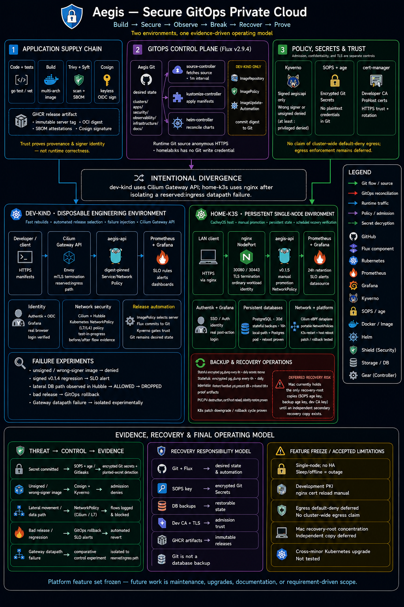

# Aegis

Self-hosted Kubernetes platform managed declaratively through Git with
FluxCD. Local development uses `kind`; a persistent home cluster (K3s,
later Talos) and an optional AWS EKS environment are long-term targets.
Security controls (admission policy, encrypted secrets, image scanning and
signing, network isolation, centralized identity) are added one layer at a
time as the platform matures — see `CLAUDE.md` for the engineering rules
that govern how this repository is built.

## Status

```
Implemented:
- reproducible dev-kind baseline: kindest/node pinned by tag + digest, Kubernetes v1.36.1
- Cilium 1.20.0 as the dev-kind CNI, installed before Flux
- Hubble Relay for flow visibility; observed traffic in docs/network/traffic-inventory.md
- Authentik PostgreSQL, server and worker ingress have workload-level
  NetworkPolicy boundaries based on observed traffic (egress not covered)
- Gateway API routing (Cilium's own controller) for grafana.aegis.test and
  auth.aegis.test, over trusted development HTTPS; HTTP redirects to HTTPS
- the Gateway's backend peer is Cilium's reserved:ingress identity, so that
  one allow rule is a CiliumNetworkPolicy; all workload peers stay portable
- cert-manager (v1.21.1) issues certificates from an Aegis development CA
  whose private key lives outside this repository — see
  docs/decisions/0011-development-ca-trust-root.md; not a publicly trusted
  CA, and not to be described as one
- Flux v2.9.4, reconstructed from committed manifests via scripts/bootstrap-flux.sh
- Flux reads this public repo over anonymous HTTPS; no GitHub token in the cluster
- SOPS + age secrets, with key/recipient verified during reconstruction
- first GitOps-managed application (apps/demo-app: podinfo)
- Prometheus + Grafana (kube-prometheus-stack via HelmRelease)
- Authentik identity; Grafana logs in via OIDC through the trusted HTTPS
  hostnames, verified with a real browser login
- Kyverno admission policies (deny privileged containers, require pinned images)
- CI: Gitleaks, Trivy config, Kyverno policy tests, Kustomize build validation
- Renovate dependency discovery (built-in managers; no automerge)
- security-lab: 5 documented attack scenarios (security-lab/)

Planned:
- wider NetworkPolicy (namespace default-deny, egress), designed from further traffic evidence
- container build/scan/SBOM/signing (needs a real image-building app repo first)
- persistent home cluster
- backup and disaster-recovery drills
```

## Prerequisites (for local development)

- Docker
- `kind`
- `kubectl`
- `flux` CLI
- `helm` (Cilium install)
- `sops` and `age` (secrets; `age-keygen` is required by bootstrap-flux.sh)

### Pinned versions

Rebuilding the cluster should reproduce the same baseline rather than
picking up whatever happens to be installed, so these are pinned:

```
Kubernetes (kind node): v1.36.1, by tag AND digest
                        (bootstrap/kind/cluster.yaml)
Flux CLI + controllers: v2.9.4
                        (clusters/dev-kind/flux-system/gotk-components.yaml)
Cilium (CNI + Hubble):  1.20.0
                        (scripts/bootstrap-cilium.sh)
```

Verify before bootstrapping a cluster:

```
flux version --client     # expect: flux: v2.9.4
```

The Flux CLI writes `gotk-components.yaml` at its own version, so a CLI
that doesn't match the committed manifest would silently upgrade (or
downgrade) the controllers on the next `flux bootstrap`. `flux version`
against a running cluster prints the controller versions for comparison
(`distribution: flux-v2.9.4`).

Upgrading either is deliberate, not incidental: pick the new version,
re-pin it (for the node image, tag **and** digest together — the digest
is the multi-arch manifest list, so it works on arm64 and amd64), then
re-run the platform validation rather than assuming the existing controls
still hold on a new baseline.

## Architecture (current stage)



*This image is out of date — it predates Authentik, the anonymous Git
reconciliation, and the current bootstrap path. No editable source for it
exists in the repository, so it can't be revised in place.
[`docs/architecture/README.md`](docs/architecture/README.md) is the
accurate, maintainable version and is what to update as the platform
changes.*

Laptop → Docker → `kind` (cluster `aegis-dev`, Cilium as CNI) → FluxCD (reconciling
`clusters/dev-kind` from this repo) → `apps/demo-app` (podinfo, namespace
`demo-app`) and `observability/kube-prometheus-stack` (Prometheus +
Grafana, namespace `observability`), with `security/kyverno` +
`security/policies` enforcing admission control on everything Flux
applies.

Create the cluster with `scripts/cluster-up.sh` and remove it with
`scripts/cluster-down.sh` (destructive — deletes all workloads on it,
no confirmation prompt). Both scripts are idempotent: re-running
`cluster-up.sh` on an existing cluster or `cluster-down.sh` with no
cluster present is a no-op rather than an error.

This repository's remote is `github.com/nhatminh06/aeigs`. Flux was
bootstrapped onto `aegis-dev` with:

```
GITHUB_TOKEN=$(gh auth token) flux bootstrap github \
  --owner=nhatminh06 --repository=aeigs --branch=main \
  --path=clusters/dev-kind --personal --token-auth
```

This uses HTTPS with a GitHub token rather than the SSH deploy key Flux
defaults to — this network blocks the SSH protocol entirely (both port
22 and `ssh.github.com:443` time out; plain HTTPS works fine), so the
default SSH bootstrap doesn't work here. Don't assume SSH works on every
network when bootstrapping elsewhere; test it first, and use
`--token-auth` if not. This generated
`clusters/dev-kind/flux-system/gotk-components.yaml` and `gotk-sync.yaml`
(an HTTPS `GitRepository` with a token-backed `secretRef`, plus a
self-managing `Kustomization`), committed them, and applied them to the
cluster. `gotk-sync.yaml`'s `Kustomization` interval was shortened from
Flux's 10m default to 1m afterward, so dev config changes converge
quickly — see the comment in that file (re-running `flux bootstrap`
regenerates this file and resets the interval; re-apply the shortened
interval if that happens).

The bootstrap token and the runtime Git credential are two different
concerns. `flux bootstrap` needs a token — it writes commits and creates
the deploy setup via the GitHub API — but that same token then sits in
the `flux-system` Secret as the credential `source-controller` uses for
every fetch afterward, indefinitely, even though this repository is
public and doesn't need one for reads. `gotk-sync.yaml`'s `GitRepository`
has had that `secretRef` deliberately removed (verified live: anonymous
HTTPS reconciliation works with it gone); see
`docs/decisions/0009-minimize-runtime-git-credentials.md`.

**That is why rebuilds no longer re-run `flux bootstrap`.** By its own
`--help`, `flux bootstrap github` "commits the Flux manifests to the
specified branch" — so re-running it regenerates `gotk-sync.yaml` with a
token-backed `secretRef` and pushes that to `main`, silently undoing the
hardening above (and resetting the 1m interval). The manifests it would
generate are already committed here, so a rebuild applies those instead
via `scripts/bootstrap-flux.sh`, which needs no GitHub token and cannot
modify the repository. The original bootstrap command is kept above as
the historical record of how `flux-system/` first came to exist, not as
the recovery procedure.

### Rebuilding the cluster

`kind` has no "stop" — `cluster-down.sh` deletes the cluster entirely,
wiping all in-cluster state. Three commands bring it back, in this order:

```
scripts/cluster-up.sh        # pinned kind node image, default CNI disabled
scripts/bootstrap-cilium.sh  # Cilium 1.20.0 + Hubble Relay -> node Ready, DNS
scripts/bootstrap-flux.sh    # Flux + sops-age + committed sync config
```

Between the first two steps the node is `NotReady` and CoreDNS has not
started — there is no pod network until Cilium is installed. That gap is
expected, not a broken cluster. Cilium is installed here rather than by
Flux because Flux's own controllers need a working pod network to
reconcile anything; see
`docs/decisions/0010-bootstrap-cilium-outside-flux.md`.

`bootstrap-flux.sh` applies the committed `gotk-components.yaml`, waits
for the CRDs and controllers, restores the `sops-age` secret from the age
key on disk, then applies `gotk-sync.yaml`. Flux takes over from there
and reconciles everything else from Git. It refuses to run against a
kubectl context other than `kind-aegis-dev`, and it needs no GitHub
token — the `GitRepository` reads this public repository anonymously.

The one thing that cannot be rebuilt from Git is the **age private key**:
it decrypts every `*.enc.yaml`, so `apps`, `observability`, and
`identity` cannot reconcile without it. Restore the *existing* key from
backup to `~/.config/sops/age/keys.txt` (or point `SOPS_AGE_KEY_FILE` at
it) before running the script — running `age-keygen` instead produces a
new key that cannot decrypt anything already committed. The script fails
loudly rather than continuing if the key is missing.

After the first bootstrap, ongoing changes to `clusters/dev-kind/` just
need a commit and push; no manual `kubectl apply` is needed.

`apps/demo-app` runs `podinfo`, wired in via
`clusters/dev-kind/apps.yaml` (a Flux `Kustomization` pointing at
`./apps/demo-app`). Both the deploy loop (Git commit → Flux → running
pod) and drift correction (manual `kubectl scale` reverted by Flux within
about a minute, matching the 1m reconcile interval) have been verified
against the real cluster. See `docs/decisions/` for why Flux and kind were
chosen.

Secrets are encrypted with SOPS + age (see
`docs/decisions/0003-use-sops-age-for-secrets.md`). Two situations look
similar and must not be confused — one generates a key, the other must
never generate one:

**Initial setup (once per repository, already done here):** generate the
first key, put its public half in `.sops.yaml` as the recipient, and back
up the private half somewhere outside Git.

```
age-keygen -o ~/.config/sops/age/keys.txt   # keep the output safe — never commit it
```

**Rebuilding an existing Aegis cluster:** restore the *existing* private
key from backup to `~/.config/sops/age/keys.txt` (or point
`SOPS_AGE_KEY_FILE` at it) and run `scripts/bootstrap-flux.sh`, which
creates the `sops-age` secret for you after checking the key matches
`.sops.yaml`'s recipient. **Do not run `age-keygen` here** — a new key
produces a new recipient and cannot decrypt anything already committed,
which is unrecoverable without the original key.

The `apps` Kustomization (`clusters/dev-kind/apps.yaml`) references this
secret via `spec.decryption`. This is a manual, non-GitOps step by
design: the key that unlocks encrypted secrets can't itself be managed by
the system it unlocks. To encrypt a new secret, name it `secret.enc.yaml`
(or `<descriptive-name>.enc.yaml` if the directory already has one —
matches `.sops.yaml`'s `path_regex`) and run `sops --encrypt --in-place
<file>`; the
`age` public key encoded in `.sops.yaml` is safe to commit, the private
key at `~/.config/sops/age/keys.txt` is not — export
`SOPS_AGE_KEY_FILE=~/.config/sops/age/keys.txt` so `sops` finds it on
macOS.

`kube-prometheus-stack` (Prometheus, Grafana, kube-state-metrics,
node-exporter, the Prometheus Operator; Alertmanager disabled) runs via a
Flux `HelmRelease` — see
`docs/decisions/0004-use-helm-for-observability.md` for why Helm was used
here specifically, and `clusters/dev-kind/observability.yaml`. Grafana's
admin credentials are a SOPS-encrypted `Secret`
(`observability/kube-prometheus-stack/secret.enc.yaml`), referenced via
`grafana.admin.existingSecret` rather than a plaintext Helm value.
Prometheus is confirmed scraping real targets (kubelet, coredns,
kube-state-metrics, node-exporter); some kind-specific control-plane
targets (etcd, scheduler, controller-manager) show as down, since kind
doesn't expose those the way a kubeadm cluster does — not yet
investigated. Grafana login and Grafana→Prometheus querying have both
been verified against the real decrypted credentials, not just assumed
from the chart installing.

Kyverno enforces two admission policies (`security/policies/`): no
privileged containers, no `latest`/missing image tags — see
`docs/decisions/0005-use-kyverno-for-admission-policy.md`. Both are in
`Enforce` mode (block, not just report) and both have been tested against
the real cluster with a passing and a failing manifest each
(`security/policies/tests/`) — actual admission rejection was observed,
not assumed from the policy YAML alone.

`security-lab/` runs deliberate attack scenarios against controls that
already exist — privileged containers, mutable/missing image tags, and
GitOps drift — each documented with the actual command run and the real
output observed, not a hypothetical. See `security-lab/README.md` for the
list and what's deliberately not a lab yet (RBAC escalation, leaked
secrets, unsigned images — none of those have a backing control in this
repo yet).

`.github/workflows/repo-security.yml` runs Gitleaks and Trivy config on
every push/PR — see
`docs/decisions/0006-repo-level-scanning.md` for why this is scoped to
repo-level scanning rather than the full source→build→scan→sign pipeline
(nothing in this repo builds a container image yet). `trivy.yaml` is the
single source of truth for scan settings, used identically by CI and
locally (`trivy config --config trivy.yaml .`). CI gates on
`HIGH`/`CRITICAL` findings.

Authentik (`security/authentik/`, `HelmRelease`, chart pinned `2026.5.6`,
in-cluster non-persistent Postgres) provides identity, with Grafana's
login wired to it via OIDC — see
`docs/decisions/0007-use-authentik-for-identity.md`, including three real
bugs hit and fixed while setting it up (an empty `grant_types`, missing
scope property mappings, and the SSH-blocked-network issue above). The
Authentik→Grafana OIDC provider/application are defined declaratively via
an Authentik **blueprint**, mounted from a SOPS-encrypted `Secret` — not
configured by hand through the Authentik UI. Verified with a real browser
login through the trusted HTTPS Gateway hostnames: Grafana provisioned a
new user (`akadmin@aegis.local`, `authLabels: ["Generic OAuth"]`) distinct
from the local `admin` account, confirmed via the Grafana API, not just
observed once in a browser.

**Normal access** is `https://grafana.aegis.test` and
`https://auth.aegis.test`, which requires:

1. Resolving both names to `127.0.0.1` — either two `/etc/hosts` entries
   or `curl --resolve <name>:443:127.0.0.1`.
2. Trusting the Aegis development CA
   (`~/.config/aegis/pki/ca.crt` by default, restored by
   `scripts/bootstrap-pki.sh`) — for reproducible testing,
   `curl --cacert <path-to-ca.crt>`; for a browser, import it into the
   OS/browser trust store. This is a **development-only CA**, not publicly
   trusted, and must never be described as production PKI. See
   `docs/decisions/0011-development-ca-trust-root.md`.

Plain HTTP on both hostnames redirects (301) to HTTPS. `kubectl
port-forward` to `authentik-server:9000` / `kube-prometheus-stack-grafana:3000`
still works — Cilium does not subject node-originated traffic to pod
ingress policy — but it is debug/recovery fallback only, not normal
access.

Every security layer described in `CLAUDE.md` beyond this is planned but
not yet present in this repository. Nothing above this stage should be
assumed to work until the Status section says it's implemented.

## Roadmap

Aegis evolves over months, in small PR-sized increments: repository
foundation, local kind cluster, Flux bootstrap, a first GitOps-managed
application, secrets (SOPS), observability (Prometheus/Grafana), admission
control (Kyverno), a security lab of deliberate attack scenarios, a
software supply-chain baseline, identity (Authentik), network policy, and
eventually a persistent home cluster with backup/disaster-recovery drills.
Each phase is implemented, validated, and documented before the next
begins.
